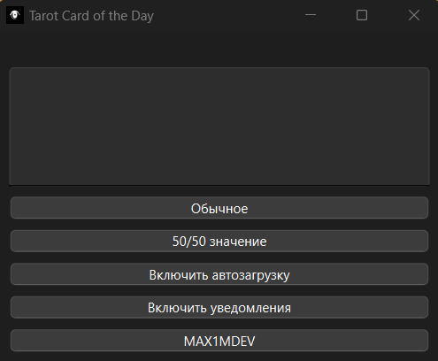

# Tarot Card of the Day
## English description
This program will help you to determine your daily tarot card. The program needs constant internet access to work properly (sending requests to tarot api).

The main point of writing this program is to understand PySide6, win11toast and use InstallForge.

The program looks like this (The program supports English language):

Normal: Outputs information about a random tarot card.

50/50 value: Displays random tarot card information depending on the card position.

### Установка
1. Go to the [Releases](https://github.com/MAX1MDEV/Tarot-Card-of-the-Day/releases/tag/release) page, download the Setup or zip-archive,
2. Run the installer or unzip the archive to a convenient location.
3. Run the Tarot Card of the day .Ink/.exe file.

### Note: If you have suggestions for updating the program create Feature request.

***

## Русское описание
Данная программа, поможет вам определить вашу дневную карту таро. Программе нужен постоянный доступ в интернет для полноценной работы (отправка запросов к tarot api).

Основная суть написания данной программы, разобраться в PySide6, win11toast и воспользоваться InstallForge.

Программа выглядит так:

Обычное: Выводит информацию о рандомной карте таро.

50/50 значение: Выводит информацию о рандомной карте таро взависимости от положения карты.

### Установка
1. Перейдите на страницу [Releases](https://github.com/MAX1MDEV/Tarot-Card-of-the-Day/releases/tag/release), скачайте Setup или zip-архив,
2. Запустите установщик или распакуйте архив в удобное место.
3. Запустите файл Tarot Card of the day .Ink/.exe.

### Note: Если у вас есть предложения для обновления программы создайте Feature request.
